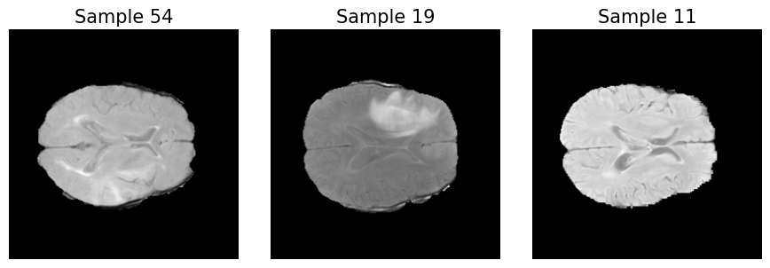
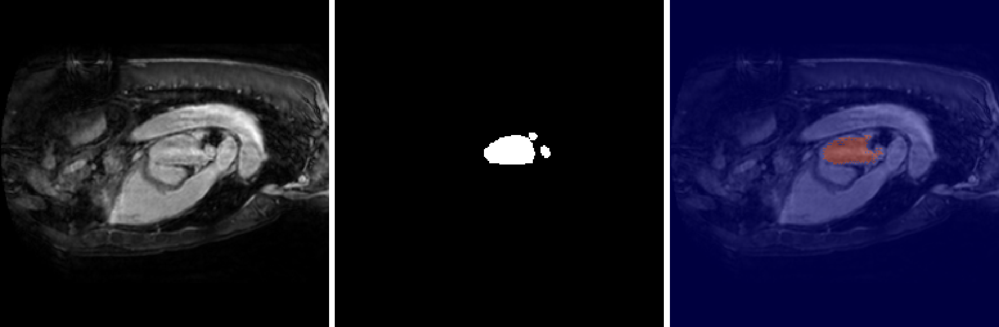

# DUViT-Net: Enhancing 2D DoubleU-Net with Vision Transformer for Medical Image Segmentation


## Table of Contents
1. [Introduction](#1-introduction)  
2. [Project Overview](#2-project-overview)  
3. [Dataset](#3-dataset)  
4. [Installation](#4-installation)  
5. [Configuration](#5-configuration)  
6. [Training the Model](#6-training-the-model)  
7. [Inference](#7-inference)  
8. [Evaluation Metrics](#8-evaluation-metrics)  
9. [Visualization](#9-visualization)  
10. [Ablation Studies](#10-ablation-studies)  
11. [Results](#11-results) 

---

## 1. Introduction
This repository contains the implementation of **DUViT-Net**, a hybrid deep learning model that integrates **DoubleU-Net** and **Vision Transformer (ViT)** blocks for 2D medical image segmentation tasks. The model is evaluated on the **Medical Segmentation Decathlon (MSD)** dataset, focusing on Brain Tumor, Heart, and Hippocampus segmentation.

---

## 2. Project Overview
- **Architecture**: DoubleU-Net + Vision Transformer (ViT)  
- **Dataset**: Medical Segmentation Decathlon (Tasks 01, 02, and 04)  
- **Primary Goal**: Improve segmentation accuracy by combining local feature extraction (CNNs) with global context modeling (ViTs).  
- **Metrics**: Dice Coefficient, Jaccard Index (IoU), HD95, F2 Score, Precision, and Recall  

---

## 3. Dataset

### Dataset Details
The dataset used in this project is sourced from the **Medical Segmentation Decathlon (MSD)** dataset:
- **Task 01**: Brain Tumor Segmentation  

- **Task 02**: Heart (Left Atrium) Segmentation  

- **Task 04**: Hippocampus Segmentation  


Refer to `task_config.yaml` for detailed configurations, including:
- Imaging Modalities  
- Number of Classes  
- Loss Functions  

---

## 4. Installation

### Prerequisites
Ensure you have the following installed:
- Python 3.8+  
- PyTorch  
- CUDA Toolkit  
- Required Libraries (NumPy, SciPy, Albumentations, etc.)  

### Setup
1. **Clone the repository**:
   ```bash
   git clone https://github.com/your-repo/duvit-net.git
   cd duvit-net
   ```
2. **Install dependencies**:
   ```bash
   pip install -r requirements.txt
   ```

---

## 5. Configuration
The `task_config.yaml` file contains configuration details for each dataset task. Adjust settings such as:
- Modalities  
- Number of Input Channels  
- Loss Functions  

**Example configuration**:
```yaml
Task01_BrainTumour:
  modalities: ['FLAIR', 'T1w', 'T1gd', 'T2w']
  in_channels: 4
  num_classes: 4
  loss_function: 'CrossEntropy'
  slice_axis: 2
```

---

## 6. Training the Model

To train DUViT-Net on a specific task (e.g., Brain Tumor segmentation):
```bash
python train_model.py --config task_config.yaml --task Task01_BrainTumour
```

### Hyperparameter Tuning
Adjust the following parameters in the training script or via command-line arguments:
- Learning Rate  
- Batch Size  
- Epochs  

Refer to `ablation.py` for hyperparameter tuning methodologies.

---

## 7. Inference

Run the inference script on test data:
```bash
python inference.py --config task_config.yaml --task Task01_BrainTumour --checkpoint model_checkpoint.pth
```
The output segmentation masks will be saved in the `results/` folder.

---

## 8. Evaluation Metrics

The following metrics are used to evaluate segmentation performance:
- **Dice Coefficient**: Measures overlap between predicted and ground truth masks.  
- **Jaccard Index (IoU)**: Measures intersection over union.  
- **Precision & Recall**: Accuracy of positive predictions and sensitivity.  
- **F2 Score**: Weighted measure emphasizing recall.  
- **HD95**: A boundary accuracy metric reflecting the 95th percentile of Hausdorff distance.

---

## 9. Visualization

Visualize segmentation results using the provided Jupyter Notebook:
```bash
jupyter notebook vis_seg.ipynb
```
This will generate overlays of ground truth vs. predicted masks for qualitative analysis.





You can modify the notebook to:
- Display different color maps or slice indexes.  
- Overlay multiple modalities if available.  
- Save visual results to a specific directory.

---

## 10. Ablation Studies

Analyze the impact of each architectural component (e.g., **ViT Blocks**, **ASPP Modules**, **SE Blocks**) using:
```bash
python ablation.py --config task_config.yaml --task Task01_BrainTumour
```
By selectively including or removing modules, you can observe how each affects segmentation performance. Results are logged for comparison and further analysis.

---

## 11. Results

| **Metric**        | **Task01 (Brain Tumor)** | **Task02 (Heart)** | **Task04 (Hippocampus)** |
|-------------------|--------------------------|--------------------|--------------------------|
| **Dice Score**    | 0.82                    | 0.72               | 0.71                     |
| **Precision**     | 0.87                    | 0.85               | 0.84                     |
| **Recall**        | 0.89                    | 0.70               | 0.70                     |
| **Jaccard Index** | 0.76                    | 0.68               | 0.67                     |
| **HD95**          | 12.7                    | 14.3               | 12.1                     |
| **F2 Score**      | 0.89                    | 0.73               | 0.72                     |

Additional details and visual comparisons can be found in the `DUVITNET.pdf` file.

---

Thank you for reading. Please feel free to reach out if you have any doubts or questions.
